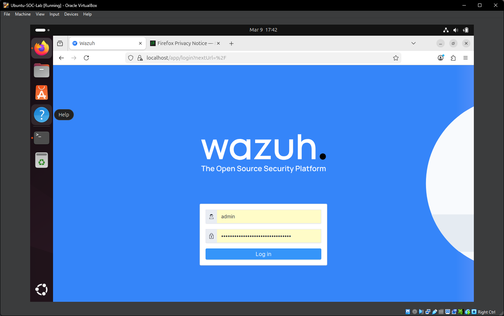
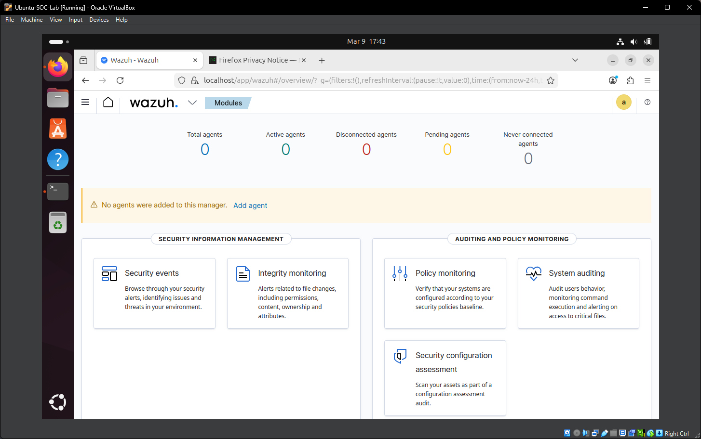
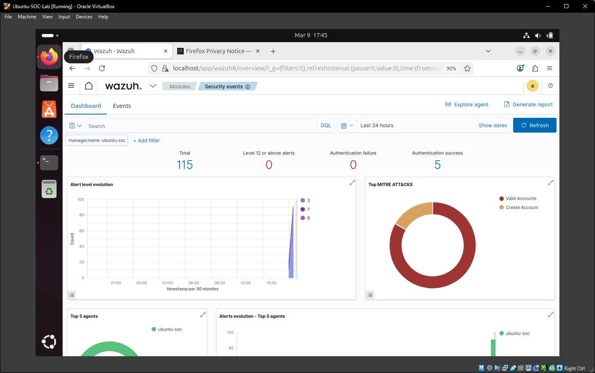
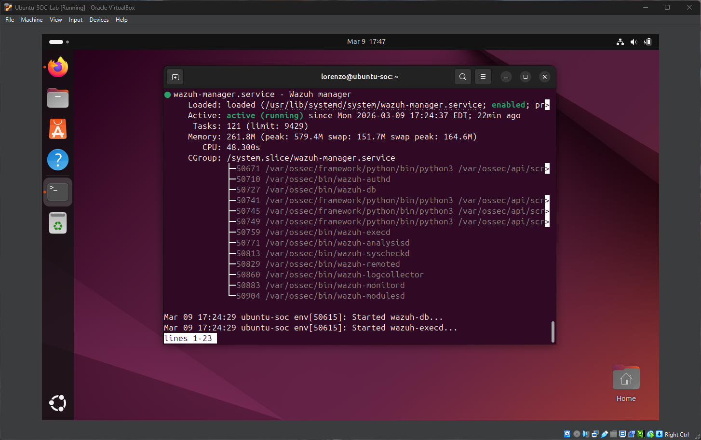
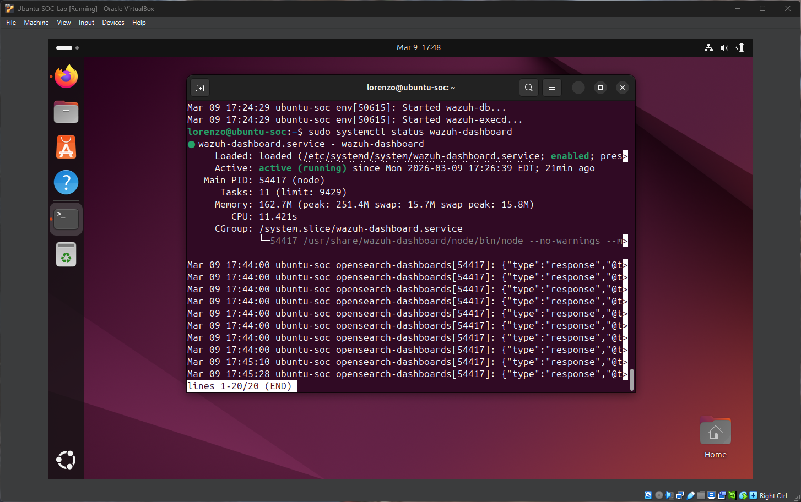

# SIEM Home Lab – Wazuh

## Project Overview
This project demonstrates the deployment of a Security Information and Event Management (SIEM) platform using **Wazuh** on an Ubuntu server. The lab simulates a basic Security Operations Center (SOC) environment where system activity and security events are monitored and analyzed.

The goal of this lab is to gain hands-on experience with:
- SIEM deployment
- Security event monitoring
- Log analysis
- System auditing
- Threat visibility

---

## Lab Environment

| Component | Role |
|----------|------|
| Ubuntu Server | Wazuh SIEM Manager |
| Wazuh Dashboard | Security Monitoring Interface |
| VirtualBox | Virtualization Platform |

---

## Tools Used

- **Wazuh SIEM**
- **Ubuntu 24.04**
- **VirtualBox**
- **Linux CLI**

---

## Key Features Demonstrated

- Deploying a SIEM platform
- Monitoring system authentication events
- Viewing security alerts
- Service verification using systemctl
- Security event visualization through the Wazuh dashboard

---

## Screenshots

### Wazuh Login Page

### Wazuh Dashboard

### Security Events Monitoring

### Wazuh Manager Service

### Wazuh Dashboard Service

---

## Skills Demonstrated

- Linux system administration
- SIEM deployment and configuration
- Security monitoring
- Log analysis
- Cybersecurity home lab development

---

## Future Improvements

Planned improvements to expand the lab:

- Add Windows endpoint monitoring
- Simulate attack detection using Kali Linux
- Monitor SSH brute-force attempts
- Integrate additional log sources
